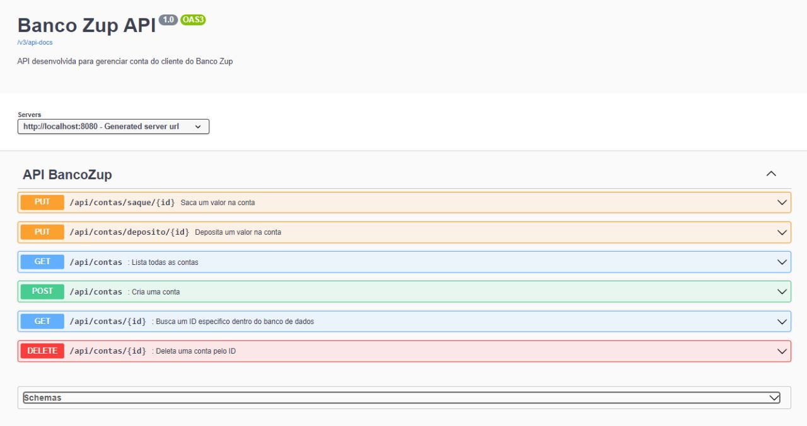

# API para Contas Bancárias

---

### 🔷 Resumo

<p>Desenvolver uma API para um banco:
</p>

- Exibir todos contas.
- Exibir de uma conta específica.
- Cadastro de uma nova conta.
- Deleção de uma conta.
- Atualização do valor atual caso tenha um depósito.
- Atualização do valor atual caso tenha um saque.


<p>Atributos:
</p>

- id.
- numero de conta.
- agencia.
- nome do usuario.
- valor atual da conta.

---

## ⏯️ Como executar os Programas

- Você precisará ter o [JDK 17](https://www.oracle.com/java/technologies/downloads/#java17) instalado no seu computador;
- Baixe o repositório do projeto (com todos os algoritmos);
- Abra o terminal e navegue até o o arquivo ApiBibliotecaApplication presente na pasta de exercício que você deseja executar;
- Compile o arquivo executando o comando `javac`, como mostra abaixo o exemplo executando o [Main](https://github.com/guiijanuario/StarWars-ExerciseModulo4/blob/main/src/main/java/org/example/exerciseModule4/Main.java) :
```
javac Main.java
```
- Após compilar, execute o comando `java`, como mostra abaixo:
```
java Main.java
```


### 🗂️ Documentação com Swagger

- Após rodar o projeto acessar o link: [Link Swagger](http://localhost:8080/swagger-ui/index.html#/)



---

## 👨‍💻 Autor

Nome: Guilherme Januário <br>Linkedin: https://www.linkedin.com/in/guilherme-janu%C3%A1rio/

---

<h4 align=center>©️ Made with 💚 by <a href="https://github.com/guiijanuario">Guilherme Januário</a></h4>
